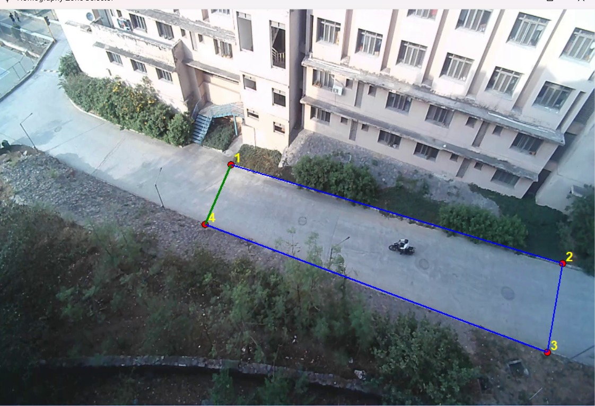
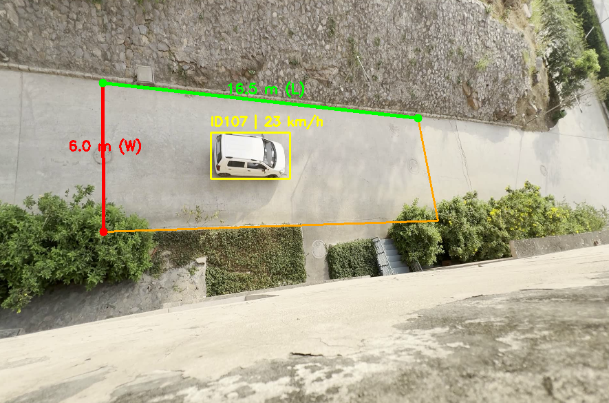

# Vision Speed Pipeline

This project detects vehicles, estimates speed, and sends API alerts for overspeed vehicles.

## Project Files

```text
Speed_Detection_Pipeline/
|- data/
|  |- testing_1.mp4
|  |- testing_2.mp4
|- detection/
|  |- detector.py
|- metadata/
|  |- bridge.py
|- logic/
|  |- speed_estimator.py
|- api/
|  |- handler.py
|- mock/
|  |- server.py
|- tools/
|  |- zone.py
|- docs/
|  |- images/
|     |- zone_sample.png
|     |- zone_real_dimensions_sample.png
|- alerts/
|  |- alert_f000001_id12_s34.jpg
|- main.py
|- .env.example
|- requirements.txt
|- README.md
```

## Module Mapping (Assignment)

1. Detection Engine: detection/detector.py
2. Metadata Bridge: metadata/bridge.py
3. Business Logic: logic/speed_estimator.py
4. Action Handler (API): api/handler.py

## What is mock/server.py?

mock/server.py is a local mock API server.

> **NOTE:** This is for local testing only. It is not your production backend.

Use it to confirm your alert POST requests are working.
When overspeed happens, the server prints:

- alert path (/speed)
- request body (vehicle_id and speed)

## What is tools/zone.py? (Very Very IMP do this carefully)

tools/zone.py helps you select 4 road points on the first video frame.

Click in this order:

1. Top-left
2. Top-right
3. Bottom-right
4. Bottom-left

It will show a warped preview so you can validate your zone.

> **IMPORTANT:** Always keep the click order exactly as **TL -> TR -> BR -> BL**.

### Zone Drawing Sample

Use this sample to understand how to draw the road zone in correct order (1 -> 2 -> 3 -> 4):



## Setup

1. Clone repository and move into project folder:

	git clone <your-github-repo-url>
	cd Speed_Detection_Pipeline

2. Create and activate conda environment:

	conda create --name myenv python=3.10
	conda activate myenv

3. Install PyTorch with CUDA 12.1 first:

	pip install torch torchvision torchaudio --index-url https://download.pytorch.org/whl/cu121

> **NOTE:** Install this before `pip install -r requirements.txt` to avoid CUDA mismatch issues.

4. Install project requirements:

	pip install -r requirements.txt

5. Copy env template:

	copy .env.example .env

6. Edit .env values for your system (model path, video path, API URL, speed limit).

Important for this repo:

- Default test video is in data/testing_1.mp4
- Keep VIDEO_PATH in .env as ./data/testing_1.mp4 unless you want another video

> **NOTE:** Keep file names exactly `testing_1.mp4` and `testing_2.mp4` if you use README defaults.

## Test Data (Google Drive)

Drive folder:

https://drive.google.com/drive/folders/1ot06Z9VoJ4Gg-rlexvjWXcv2LPyZilPx?usp=drive_link

This folder contains:

- testing_1.mp4
- testing_2.mp4
- Speed_Annotated_Outputs/ (annotated speed output videos for both test videos)

How to use:

1. Download one or both videos.
2. Put them inside the local data folder:

	Speed_Detection_Pipeline/data/

3. In .env, set VIDEO_PATH to whichever file you want to run:

	VIDEO_PATH=./data/testing_1.mp4
	or
	VIDEO_PATH=./data/testing_2.mp4

> **IMPORTANT:** If `VIDEO_PATH` is wrong, pipeline will fail to read FPS and stop.

## Run Pipeline + Alert Test

1. Start mock server in terminal 1:

	python mock/server.py

2. Run speed pipeline in terminal 2:

	python main.py

3. When a vehicle crosses speed limit, you should see alert logs in server terminal.

4. On every overspeed alert event, the current annotated frame is saved in the alerts folder.

   Example filename:

	alert_f000120_id7_s28.jpg

> **NOTE:** If you do not see alerts, lower `SPEED_LIMIT_KMH` in `.env` for testing.

## Optional: Run Zone Selector

	python tools/zone.py

Use the clicked points to update road zone in main.py if needed.

## Very Important: Update These 2 Things In main.py

Before final run, make sure these are correct for your camera and road.

Current project calibration already set in main.py:

- SRC_POINTS = [(152,124), (610,175), (639,324), (153,340)]
- REAL_ROAD_WIDTH_METERS = 6.0
- REAL_ROAD_LENGTH_METERS = 16.5

Note: `REAL_ROAD_WIDTH_METERS` and `REAL_ROAD_LENGTH_METERS` are **not** full road width/length. They represent the real-world width and length of the **selected zone (ROI)** only. These values were measured manually by me on-site using shoe-feet stepping approximation.

### Zone Real-World Dimension Reference

This sample shows the exact zone used for mapping real-world width/length in the speed calculation:



> **IMPORTANT:** Wrong zone points or wrong real road dimensions will directly give wrong speed values.

If you are using the same camera view, keep these values as-is.

1. Zone points (SRC_POINTS)

- In main.py, update SRC_POINTS with the 4 points you got from zone.py.
- Keep this click/order format:
	- 1) Top-left
	- 2) Top-right
	- 3) Bottom-right
	- 4) Bottom-left

2. Real road size

- In main.py, update:
	- REAL_ROAD_WIDTH_METERS
	- REAL_ROAD_LENGTH_METERS
- These are the real-world dimensions of your selected **zone**, not the full visible road.
- These values are used to convert pixel movement to real speed.
- If these values are wrong, displayed speed will be wrong.

Quick workflow:

1. Run tools/zone.py
2. Copy final 4 points into SRC_POINTS in main.py
3. Set correct road width/length in meters
4. Run main.py and verify speed labels

## Design Choices (Simple Reasoning)

1. Modular structure
- Split into detection, metadata, logic, and API modules to match assignment and keep code easy to maintain.

2. YOLO + ByteTrack for detection/tracking
- YOLO gives strong object detection.
- ByteTrack keeps stable IDs across frames, which is needed for speed estimation.

3. Homography for real-world speed
- Pixel motion alone is not real speed.
- Homography maps movement into a road-aligned view so distance can be converted to meters.

4. Frame skipping + effective FPS
- Processing every frame is heavy.
- We process at target FPS and use effective FPS in formula so speed remains consistent.

5. EMA smoothing + speed cap
- Raw frame-to-frame speed can jump due to detector noise.
- EMA smooths values and max-speed cap removes unrealistic spikes.

6. API action decoupled from core logic
- Detection/speed logic should not depend on backend implementation.
- API handler is separate so alert integration can change without touching core pipeline.

7. Mock server for verification
- `mock/server.py` makes API testing easy before real backend integration.
- Confirms that overspeed events are actually being sent.

## Future Work

1. TensorRT optimization
- Export model to TensorRT for faster inference and lower latency on supported GPUs.

2. Better UI layer
- Add a simple dashboard to view live detections, speed logs, and alert screenshots.

3. Notification module expansion
- Keep API handler modular and add pluggable channels like email, SMS, and push notifications.

4. More robust backend integration
- Add event queue, retry logic, and alert history storage for production reliability.

## Author Note

- Core logic, implementation decisions, and project integration were done by me.
- I used GPT Copilot support for formatting, documentation polishing, and minor cleanup help.
